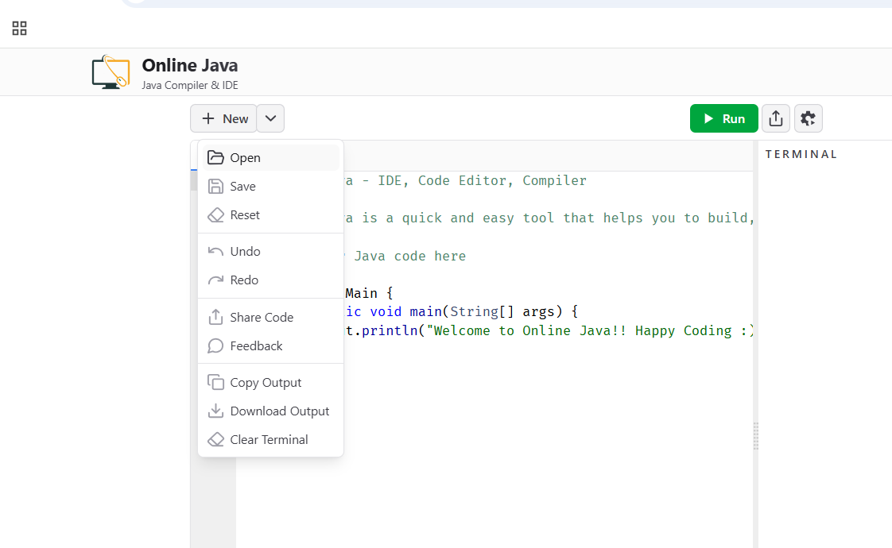

## Fix The Code: Sorting algorithms

### <u>Context</u>

The source folder contains a code with some [sorting algorithms](https://en.wikipedia.org/wiki/Sorting_algorithm) for integer arrays, which are algorithms that organize elements by how each element is compared to other. For example, we can sort an integer array from the smaller to the greater number. Or we can sort strings alphabetically.

Among the sorting algorithms, there are the Bubble Sorter and the Insertion Sorter. The following gif example shows visualy how these algorithms works and how they're implemented in the code of this problem

#### <u>Examples</u>

##### Bubble Sort simulation example

##### Insertion Sort simulation example

---

### <u>Problem</u>

In this problem:
- There are syntax error that will prevent the program to be compiled.
- There are some runtime errors that will make the program to crash or behave unexpectedly.
- There are some semantic errors that will make the program to run, but will return the wrong result.

a. Fix all syntax errors, so the program compile.

b. Fix all runtime errors so the program run without crash.

c. Fix all semantic errors so the array is sorted from the *smaller number to the greater number*.

d. At the end, the main function will execute both Bubble sorter and Insertion sorter algorithms.

---

### <u>Browser Setup Instructions</u>

1. Access the site [Online-java](https://www.online-java.com/).
2. Import the code there using the Open option:

3. Select the files from java files from [Source](https://github.com/edupinhata/codeInterview/raw/refs/heads/main/Problems/FixTheCode/FTC_1_sorting-algorithms/java/source.zip)

4. To run the code, be sure you have the Main.java file selected.

---

### <u>Local Setup Instructions</u>

OBS: for this step you need to have Java configured in your machine.

1. Create a java project.
2. Add the java files in your project. Start by compiling and running Main.java.