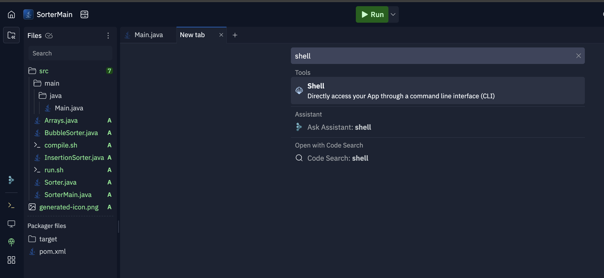
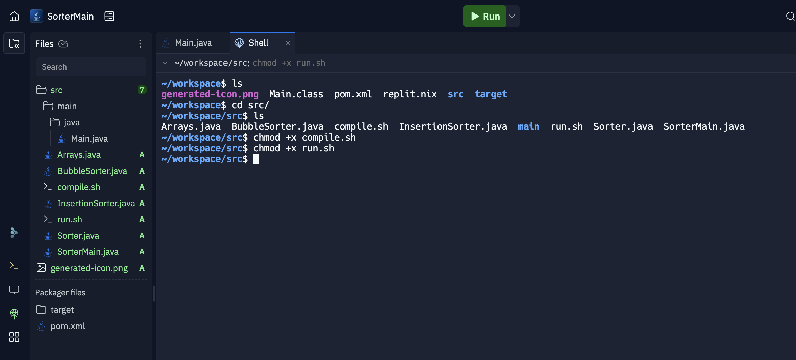

## Fix The Code: Sorting algorithms

### <u>Problem</u>

The source folder contains a code with some [sorting algorithms](https://en.wikipedia.org/wiki/Sorting_algorithm) for integer arrays.

In this problem:
- There are syntax error that will prevent the program to be compiled.
- There are some runtime errors that will make the program to crash or behave unexpectedly.
- There are some semantic errors that will make the program to run, but will return the wrong result.

a. Fix all syntax errors, so the program compile.

b. Fix all runtime errors so the program run without crash.

c. Fix all semantic errors so the array is sorted from the *smaller number to the greater number*.

d. (Optional) After fix the errors, you can improve the code quality to make it easier to read, more organized, or even more optimized.

### <u>Setup Instructions</u>

1. Download the Source folder [clicking here](./source.zip)

2. Create a Repl of **Java** with the name **SorterMain**

Select **Choose a Template** tab.

Select **Java** as Template.

Add the Title as **SorterMain** and click in **Create App**.

3. Add the files of Problem1 folder in the Repl.it created on step 2. Either drag and drop, or use the upload function in the three dots menu of repl.it.  !!! Don't upload the folder, but only the files to repl.it !!!

4. Open the shell using the + icon in the tabs. Use the following command to give execution permission to compile.sh and run.sh:
> chmod +x compile.sh

> chmod +x run.sh

4. To compile and run, run in repl.it shell the following command:
> sh ./compile.sh; sh ./run.sh

### <u>Examples</u>

#### Bubble Sort simulation example

#### Insertion Sort simulation example

