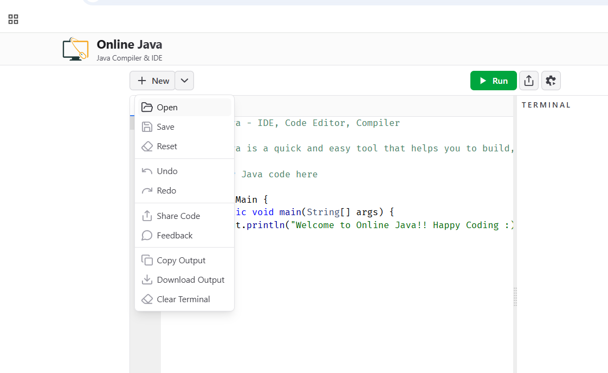

## Fix The Code: Sorting algorithms

### <u>Context</u>

The source folder contains a code with some [sorting algorithms](https://en.wikipedia.org/wiki/Sorting_algorithm) for integer arrays, which are algorithms that organize elements by how each element is compared to other. For example, we can sort an integer array from the smaller to the greater number. Or we can sort strings alphabetically.

Among the sorting algorithms, there are:

- **Bubble Sorter:** sorts by repeatedly swapping the adjacent elements if they are in the wrong order. The algorithm gets its name because smaller elements "bubble" to the top of the list.
- **Selection Sorter:** sorts by repeatedly selecting the smallest (or largest) element from the unsorted portion of the list and swapping it with the first unsorted element.
- **Insertion Sorter:** sorts by building the final sorted array one item at a time, with the assumption that the first element is already sorted. Each new element is compared with the elements in the sorted portion and inserted in the correct position.
- **Counting Sorter:** sorts by counting the number of occurrences of each element and using this information to place each element in its correct position.
- **Merge Sorter:** sorts by dividing the array into halves, sorting each half, and then merging the sorted halves back together.

The following images example shows visualy how these algorithms works and how they're implemented in the code of this problem:

#### <u>Examples</u>

##### Bubble Sort simulation example

##### Selection Sort simulation example

##### Insertion Sort simulation example

##### Counting Sort simulation example

##### Merge Sort simulation example

---

### <u>Problem</u>

In this problem:

- There are syntax error that will prevent the program to be compiled.
- There are some runtime errors that will make the program to crash or behave unexpectedly.
- There are some semantic errors that will make the program to run, but will return the wrong result.

a. Fix all syntax errors, so the program compile.

b. Fix all runtime errors so the program run without crash.

c. Fix all semantic errors so the array is sorted from the **SMALLER NUMBER to the GREATER NUMBER**.

d. At the end, the main function should execute all sorter algorithms for a small array. It should also execute a performance test for a large array, comparing the result of each algorithm with the result of Java's built-in sorting method.

OBS: All errors are small and simple, but they are spread across the code. If you are changing more than 3 lines in a file, you are probably changing more than just the error. Try to find the smallest change that can fix the error.

---

### <u>Browser Setup Instructions</u>

1. Access the site [Online-java](https://www.online-java.com/).
2. Import the code there using the Open option:

3. Select the files from java files from [Source](https://github.com/edupinhata/codeInterview/raw/refs/heads/main/Problems/FixTheCode/FTC_1_sorting-algorithms/java/source.zip)

4. To run the code, be sure you have the Main.java file selected.

---

### <u>Local Setup Instructions</u>

OBS: for this step you need to have Java configured in your machine.

1. Create a java project.
2. Add the java files in your project. Start by compiling and running Main.java.